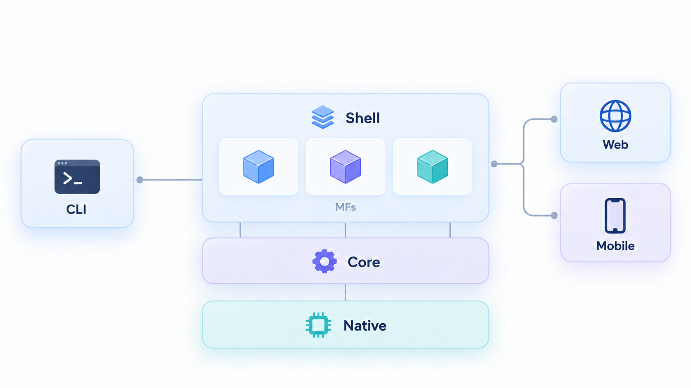
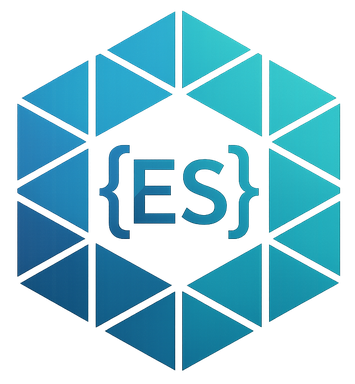
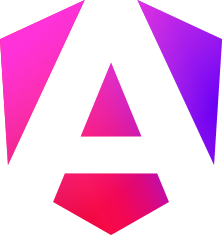

<p align="center">
  
</p>

# Open Mova

Framework para aplicaciones web y móviles con Angular, Native Federation y
Capacitor. Cada aplicación tiene una shell técnica y carga microfrontales
**remotos**; no se empaquetan dentro de la shell. Este repositorio es un
monorepo Git, pero cada proyecto npm instala sus dependencias por separado.

<p align="center">
  
</p>

## Tecnologías

<table>
  <tr>
    <td align="center" valign="middle"></td>
    <td valign="middle"><a href="https://native-federation.com" target="_blank" rel="noopener noreferrer">Native Federation</a></td>
  </tr>
  <tr>
    <td align="center" valign="middle"></td>
    <td valign="middle"><a href="https://angular.dev" target="_blank" rel="noopener noreferrer">Angular</a></td>
  </tr>
  <tr>
    <td align="center" valign="middle"></td>
    <td valign="middle"><a href="https://capacitorjs.com" target="_blank" rel="noopener noreferrer">Capacitor</a></td>
  </tr>
</table>

## Proyectos

| Proyecto                 | Versión  | npm                                                                                                                                                                                       | Doc                                                                                                                                   |
| ------------------------ | -------- | ----------------------------------------------------------------------------------------------------------------------------------------------------------------------------------------- | ------------------------------------------------------------------------------------------------------------------------------------- |
| `@open-mova`             | `0.2.17` |                                                                                                                                                                                           | <a href="README.md"></a>                 |
| `@open-mova/core`        | `0.2.7`  | <a href="https://www.npmjs.com/package/@open-mova/core" target="_blank" rel="noopener noreferrer"></a> | <a href="open-mova-core/README.md"></a>       |
| `@open-mova/cli`         | `0.1.30` | <a href="https://www.npmjs.com/package/@open-mova/cli" target="_blank" rel="noopener noreferrer"></a>  | <a href="open-mova-cli/README.md"></a>        |
| `@open-mova/shell`       | `0.2.6`  |                                                                                                                                                                                           | <a href="open-mova-shell/README.md"></a>  |
| `@open-mova/mf-template` | `0.2.8`  |                                                                                                                                                                                           | <a href="open-mova-mf-template/README.md"></a> |

```text
open-mova/
├── .github/                # Automatizaciones y workflows
├── assets/                 # Recursos de marca y documentación
├── open-mova-shell/        # Contenedor y capacidades nativas
├── open-mova-core/         # Contratos y acceso Angular por DI
├── open-mova-mf-template/  # Única fuente de microfrontal y demo local
├── open-mova-cli/          # Comandos mova
└── tooling/                # Lint, formato y pruebas end-to-end
```

## Microfrontal Demo publicado

Cada tag `vX.Y.Z` publica el microfrontal demo en GitHub Pages. La URL estable
es `https://rgarciadelongoria.github.io/open-mova/remoteEntry.json` y se usa
como `productionRemoteEntry` de `home`. La misma publicación incluye un segundo
remoto de calculadora en
`https://rgarciadelongoria.github.io/open-mova/calculator/remoteEntry.json`.
`mova create` genera ambos MFs a partir de una única fuente y registra esas
dos URLs. Sirven
para pruebas rápidas y simuladores; una aplicación real debe sustituirla por
la URL HTTPS y versionada de su propio microfrontal.

## Remotos en producción

Antes de desplegar, registra en `mova.config.json` los orígenes HTTPS de
confianza y una URL versionada por cada MF. Genera el artefacto final con:

```bash
mova doctor
mova build --production
```

La guía de [remotos en producción](docs/production-remotes.md) explica la
política de orígenes, CSP, CORS, rollback y el modelo de confianza entre
proveedores.

## Preparación

Requiere Node.js 22, npm y Git. Desde la raíz:

```bash
npm --prefix open-mova-mf-template install
npm --prefix open-mova-shell install
npm --prefix open-mova-cli install
npm --prefix tooling install
```

`open-mova-core` se instala desde npm en la shell y el template. Instala sus
dependencias locales solo si vas a desarrollar la propia librería:

```bash
npm --prefix open-mova-core install
```

El `package.json` raíz solo coordina comandos; no tiene dependencias ni
`node_modules` propios.

## Demostración local

Inicia el microfrontal y la shell en terminales distintas:

```bash
npm run start:demo
```

```bash
npm start
```

Abre `http://localhost:4200/demo/inicio`, `/demo/device` o `/demo/camera`.

El remoto publica `remoteEntry.json` en el puerto 4300.

La shell lee la URL desde
`open-mova-shell/src/assets/federation.manifest.json` y la ruta desde
`open-mova-shell/src/app/application.config.ts`.

Esas entradas son solo para el desarrollo de este monorepo; una app creada por
el CLI recibe su propia configuración en `mova.config.json`.

## Comandos de coordinación

| Comando                | Función                                                      |
| ---------------------- | ------------------------------------------------------------ |
| `npm start`            | Iniciar shell en 4200.                                       |
| `npm run start:demo`   | Iniciar remoto en 4300.                                      |
| `npm run start:cli`    | Ejecutar CLI en desarrollo.                                  |
| `npm run typecheck`    | Comprobar tipado de todos los proyectos.                     |
| `npm run build`        | Compilar todos los proyectos.                                |
| `npm test`             | Compilar y ejecutar las pruebas automáticas.                 |
| `npm run pack:check`   | Empaquetar Core y CLI e instalarlos en un proyecto temporal. |
| `npm run lint`         | Comprobar las reglas de calidad del código.                  |
| `npm run format:check` | Comprobar el formato sin modificar archivos.                 |
| `npm run format`       | Aplicar el formato compartido.                               |
| `npm run test:e2e`     | Probar en navegador la integración entre shell y MF.         |
| `npm run build:core`   | Compilar contratos.                                          |
| `npm run build:shell`  | Compilar shell.                                              |
| `npm run build:demo`   | Compilar microfrontal de referencia.                         |
| `npm run build:cli`    | Compilar CLI.                                                |

Consulta los README de cada proyecto para sus comandos y responsabilidades.
Para crear una aplicación o un microfrontal, empieza por
[`open-mova-cli/README.md`](open-mova-cli/README.md).
