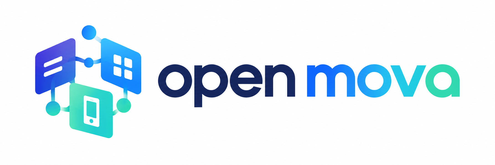

<p align="center">
  
</p>

# Microfrontal de demostración

Este es el único proyecto fuente de microfrontal que utiliza el CLI. Se publica
junto con la shell en los tags `vX.Y.Z` del monorepo. La shell de desarrollo lo
carga como remoto en `/demo` desde el puerto `4300`.

El perfil **demo** es una documentación interactiva de las capacidades nativas
oficiales de Capacitor que expone Open Mova. Cada capacidad tiene su propia URL,
pero comparte una única pantalla mantenible basada en un catálogo. Los ejemplos
usan `injectNativeCapabilities()` de `@open-mova/core`; la implementación de
Capacitor sigue viviendo en la shell.

Al abrir el MF sin shell se muestra igualmente la documentación. Los ejemplos
nativos requieren abrirlo a través de una shell porque el bootstrap independiente
solo proporciona el contrato mínimo de Device y Camera.

El CLI descarga este proyecto sin duplicar su configuración Angular. Para
`mova create`, lo copia como `mfs/home` con perfil demo. Para `mova mf create`,
lo personaliza con el perfil **minimal**: sustituye las rutas de demostración
por una única ruta inicial y quita la dependencia de core.

## Desarrollo local

```bash
npm install
npm start
```

Después inicia la shell y abre `http://localhost:4200/demo/inicio`. Las demás
rutas se generan a partir de `capability-catalog.ts`; por ejemplo,
`http://localhost:4200/demo/camera` o `http://localhost:4200/demo/network`.
Para verificar este proyecto: `npm run typecheck` y `npm run build`.

## Estructura del código

Las rutas se mantienen en `src/app/app.routes.ts` y solo enlazan cada URL con
su componente. La implementación está separada por responsabilidad:

```text
src/app/
├── app.routes.ts
├── capabilities/
│   └── capability-catalog.ts
├── layout/
│   ├── demo-layout.component.ts
│   └── demo-layout.component.html
└── pages/
    ├── home/
    ├── capability/
    │   ├── capability-page.component.ts
    │   ├── capability-page.component.html
    │   └── capability-page.component.css
    └── home/
```

`capability-catalog.ts` es la fuente de verdad de la documentación, el orden
del menú y las URLs. `app.routes.ts` crea una ruta por cada entrada y
`capability-page.component` presenta la capacidad y ejecuta los ejemplos que
son seguros de probar. Esto evita duplicar componentes casi idénticos.

Los estilos de demostración están en `layout/demo-layout.component.css`. No se
usan estilos globales del proyecto porque, al cargar el MF como remoto, Native
Federation no garantiza que la shell incorpore su hoja global. El layout viaja
con las rutas del remoto y aplica los estilos dentro de `.page-shell`.

El favicon está en `src/assets/favicon.png`. Se genera a partir del logo de
Open Mova y Angular lo publica como `assets/favicon.png`.
